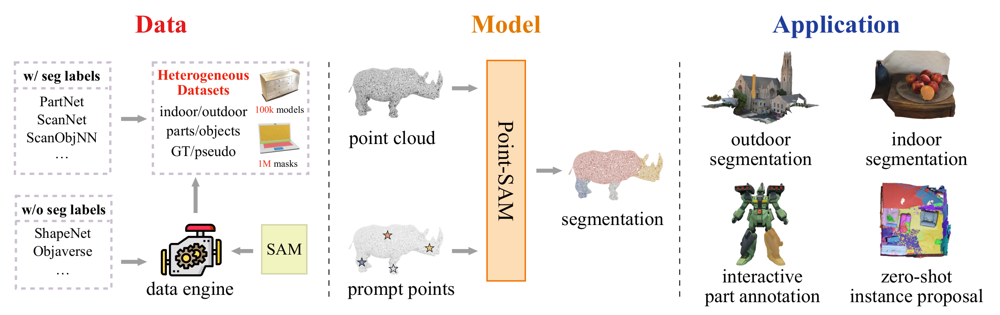
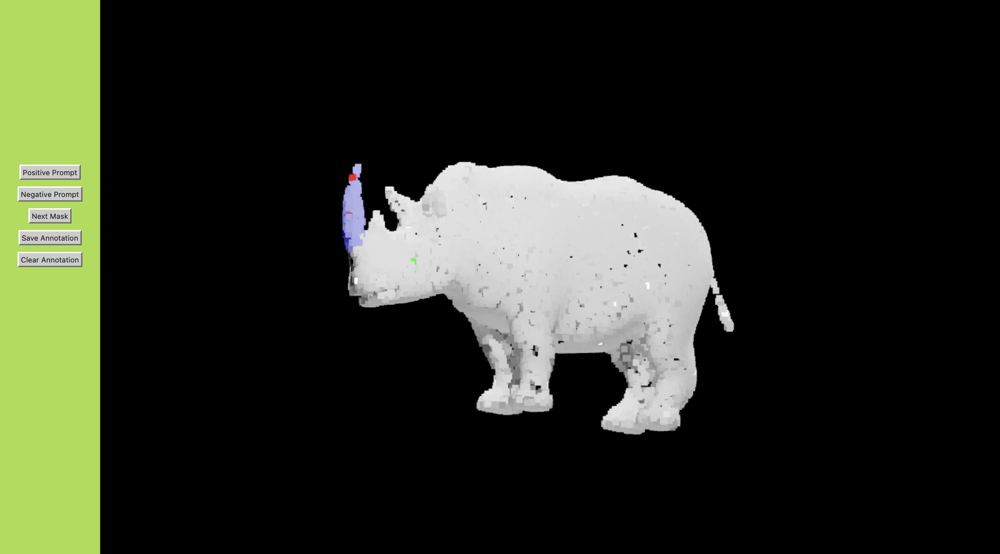
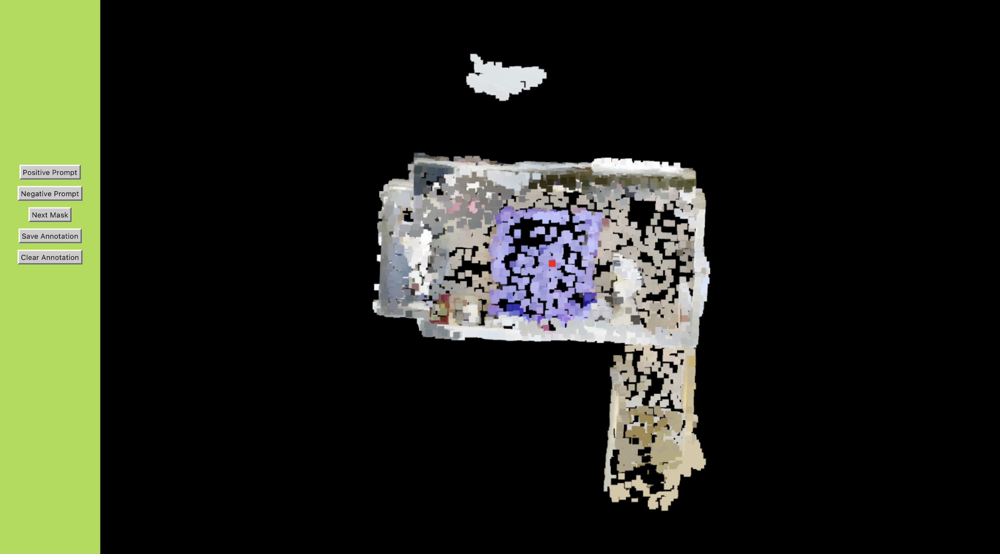

<div align='center'>

<h2>Point-SAM: Promptable 3D Segmentation Model for Point Clouds</h2>


[Yuchen Zhou](https://github.com/zyc00) <sup>\* 1</sup>, [Jiayuan Gu](https://cseweb.ucsd.edu/~jigu/) <sup>\* 1</sup>, [Tung Yen Chiang](https://github.com/tungyen)<sup>1</sup>, [Fanbo Xiang](https://www.fbxiang.com)<sup>1</sup>, [Hao Su](https://cseweb.ucsd.edu/~haosu/)<sup>1,2</sup>

UC San Diego, Hillbot

<sup>* </sup>Equal Contribution

</div>

<div align="center">

[](https://arxiv.org/abs/2406.17741)
[](https://point-sam.github.io)
[](https://huggingface.co/spaces/yuchen0187/Point-SAM)

</div>

<p>
  
  <!-- <embed src="/assets/teaser_new.pdf", width="100%"> -->
</p>

### Release Schedule:
- [x] training code
- [x] evaluation code
- [x] evaluation data
- [ ] training data
- [ ] code for data engine

We will provide the training datasets as soon as posible.

### Mesh Segmentation Demo

Our model support mesh segmentation by sampling points from the mesh and propagate segmentation labels back to the mesh. We deployed a huggingface demo at 🤗[demo](https://huggingface.co/spaces/yuchen0187/Point-SAM)🤗. We also provide local mesh segmentation demo at https://github.com/zyc00/point-sam-demo. Some meshes in glb format are provided in [examples](https://github.com/zyc00/point-sam-demo/tree/main/examples).

<p>
  
  
</p>

### Installation
The code requires `python>=3.8`, `timm>=0.9.0`, `pytorch>=2.1.0`, `torchvision>=0.16.0`. Please follow the offcial guide to install Pytorch, timm and TorchVision dependencies. We also recommend compiling third partiy modules with `g++=9.3.0`.

Install third party modules.
```
# Install g++=9.3.0 in conda environment by
conda install gxx_linux-64=9.3.0
# Install torkit3d
git submodule update --init third_party/torkit3d && 
FORCE_CUDA=1 pip install third_party/torkit3d &&
# Install apex
git submodule update --init third_party/apex &&
pip install -v --disable-pip-version-check --no-cache-dir --no-build-isolation --config-settings "--build-option=--cpp_ext" --config-settings "--build-option=--cuda_ext" third_party/apex
```

### Getting Start

#### Training
We use `accelerate` as our training framework. The training scripts are in `scripts`. For example, if you want to train Point-SAM with ViT-large encoder, run `bash scripts/train_large.sh`.

#### Evaluation and Inference
We provide pretrained [checkpoint](https://huggingface.co/yuchen0187/Point-SAM/tree/main) for Point-SAM with ViT-L on HuggingFace. After downloading the checkpoint, you can inference with the following codes. For different numbers of points, we allow custom `group_number` and `group_size`. The default setting is `group_number=512` and `group_size=64`, and we suggest setting `group_number=2048` and `group_size=256` while the number of points > 100k.

The evaluation code for KITTI360 is provided in `evaluation/eval_kitti.py`. You can run it by `python eval_kitti.py --config large --ckpt_path your_ckpt_path`. You can find the evaluation datasets in [AGILE3D](https://drive.google.com/file/d/1cqWgVlwYHRPeWJB-YJdz-mS5njbH4SnG/view?usp=sharing). We appreciate AGILE3D for providing evaluation datasets.

If you want to inference with your own point clouds and prompt points, see the codes in `evaluation/inference.py`.


#### Demo Usage

We only support meshes in GLB format. If your mesh is not in GLB format, please convert it first. For our demo, you can simply drag a mesh into the browser, and the backend will encode the point cloud. Once encoding is complete, the camera view will adjust for optimal viewing. Then, you can interact with the demo by clicking on the mesh surface.

The performance of the Hugging Face demo is limited by data transfer and a shared GPU backend. To experience better performance, try running our local demo on your device by executing `python app.py`.

### Point Cloud Segmentation Demo

<p>
  
  
</p>

We provide a local demo for Point-SAM in [demo](./demo/). Some point cloud examples are provided in `demo/static/models`. If you want to try our demo, first install backend dependencies.
```
pip install flask flask-cors
```
Run the backend with following commands, you can change `--host` and `--port` to your IP address. 
```
python demo/app.py --host localhost --port 5000 --pointcloud scene.ply --checkpoint ./pretrained/model.safetensors
# python demo/app.py --host localhost --port 5000 --pointcloud rhino.ply --checkpoint ./pretrained/model.safetensors
# python demo/app.py --host localhost --port 5000 --pointcloud tiko_10000_points.ply --checkpoint ./pretrained/model.safetensors
# python demo/app.py --host localhost --port 5000 --pointcloud tiko_50000_points.ply --checkpoint ./pretrained/model.safetensors
```

### Acknowledgement
We refer to [SAM](https://github.com/facebookresearch/segment-anything), [Uni3D](https://github.com/baaivision/Uni3D) and [OpenShape](https://github.com/Colin97/OpenShape_code) while developing Point-SAM. Thanks for these awesome works. We also thank @YouJiacheng for providing constructive suggestions for the data engine design.

### Citation
```
@misc{zhou2024pointsampromptable3dsegmentation,
      title={Point-SAM: Promptable 3D Segmentation Model for Point Clouds}, 
      author={Yuchen Zhou and Jiayuan Gu and Tung Yen Chiang and Fanbo Xiang and Hao Su},
      year={2024},
      eprint={2406.17741},
      archivePrefix={arXiv},
      primaryClass={cs.CV}
      url={https://arxiv.org/abs/2406.17741}, 
}
```
